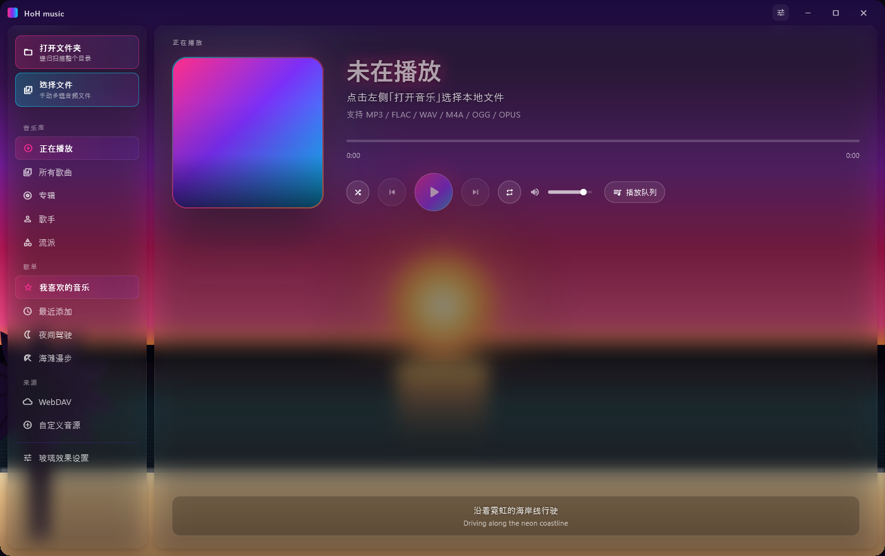
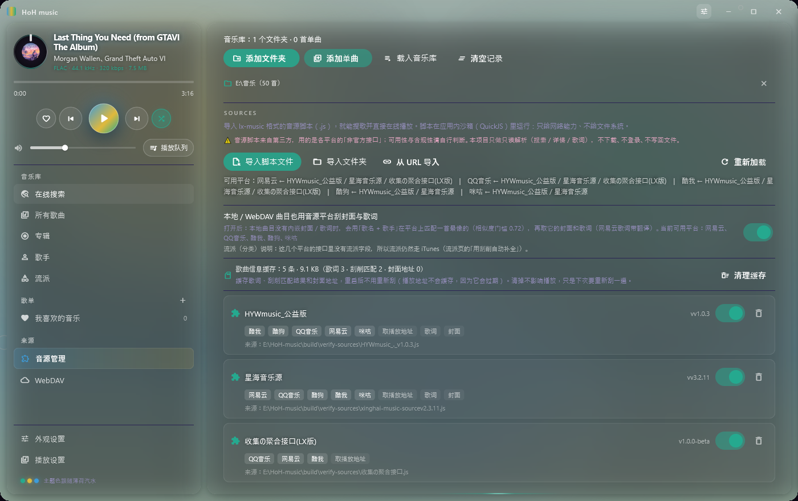
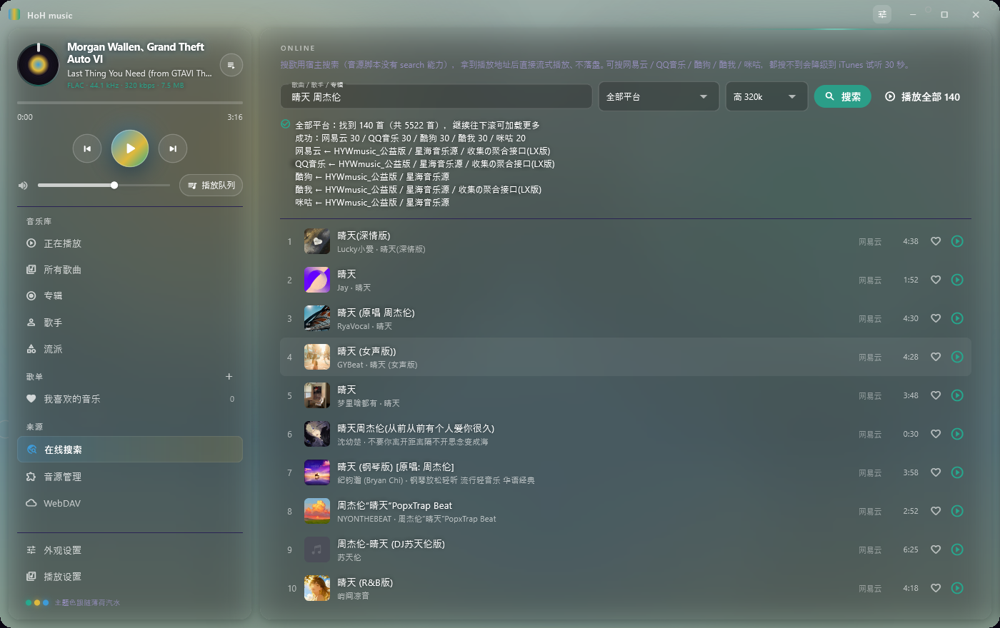
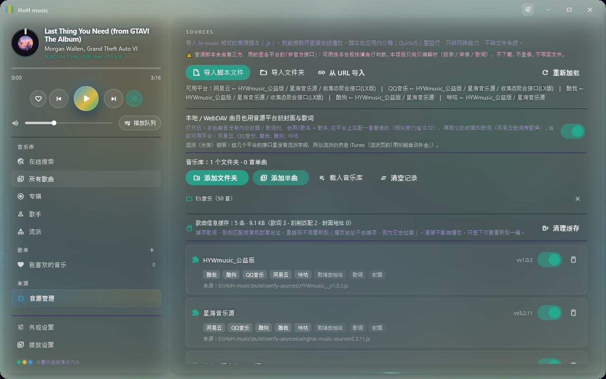
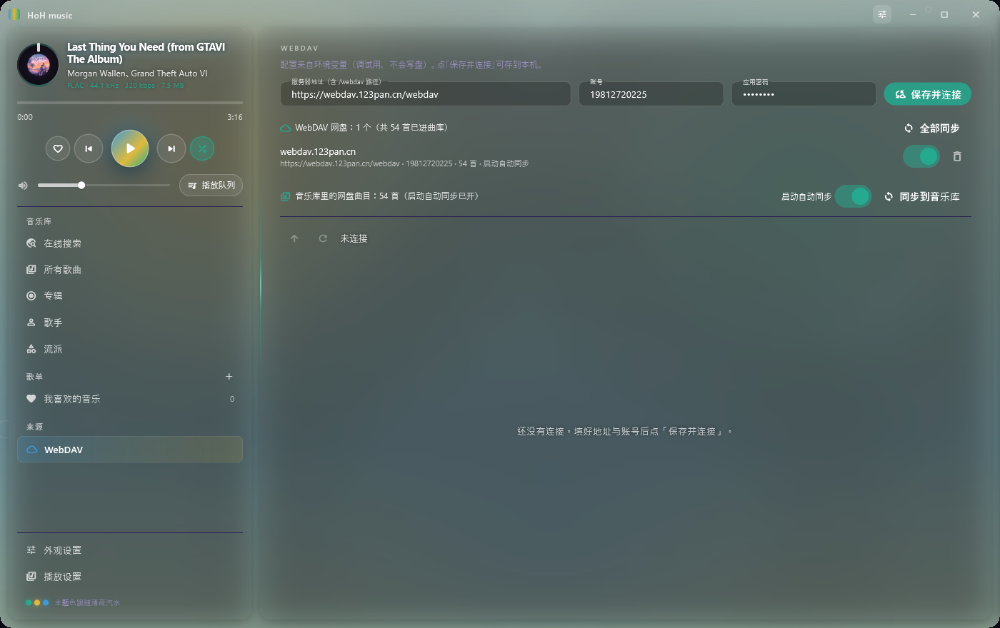
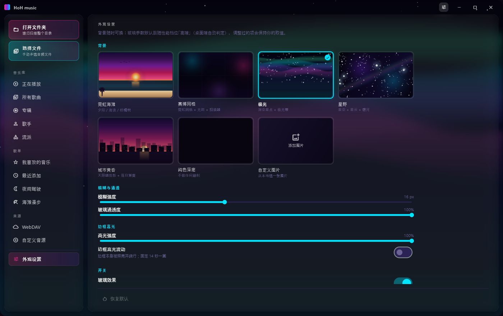
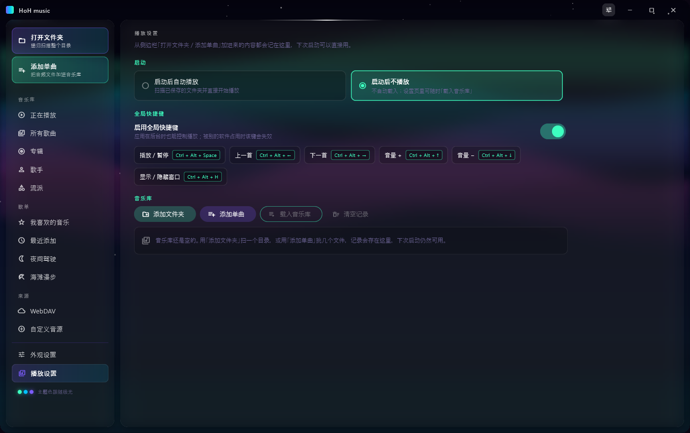
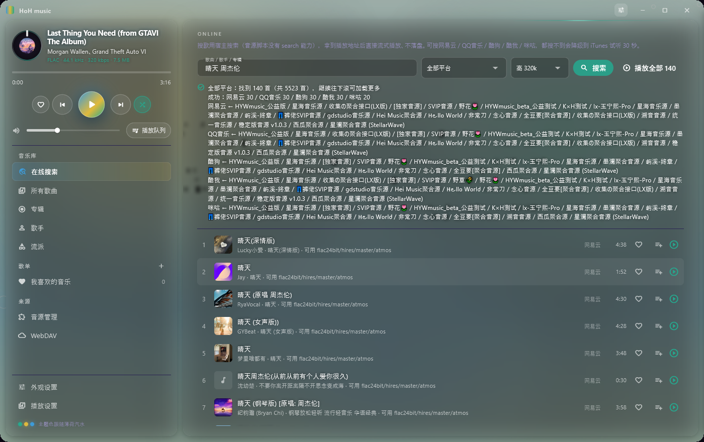

# HoH music

默认音源脚本来自程序目录的 `music音源` 文件夹；启动时自动扫描并登记其中可用脚本，不再从旧的 `assets/sources` 读取。用户仍可手动导入其他脚本。

HoH music 是基于 Flutter/Dart 的音乐播放器。当前可运行和验收的发布目标为 **Windows 桌面**；代码采用共享 Flutter UI 与业务逻辑，其他平台尚未达到可构建/发布状态。

本项目采用 **GNU GPL 第 3 版（GPL-3.0-only）**，完整条款见根目录 [LICENSE](LICENSE)。这表示项目采用 GPLv3 本版，不自动包含未来版本；第三方依赖和素材仍分别遵循其各自许可证。

> 当前开发版本：`0.1.0-beta.1+1`。这是 beta 候选版本号，不代表已通过发布验收。请先查看下方验证状态和 [项目交接](docs/项目进度交接.md)。

项目仓库：[github.com/Huomnh/HoH-music](https://github.com/Huomnh/HoH-music)；欢迎提交 Issue 反馈 Bug 或功能建议。

## 开源项目致谢

感谢以下开源项目及其维护者提供的工具、数据、渲染算法和设计启发。HoH music 使用的运行时依赖、改编代码及许可范围见[开源项目与协议清单](docs/开源项目与协议清单.md)。

- [Flutter](https://github.com/flutter/flutter)、[Riverpod](https://github.com/rrousselGit/riverpod)、[MediaKit](https://github.com/media-kit/media-kit)：应用 UI、状态管理与音频播放基础。
- [LX Music Desktop](https://github.com/lyswhut/lx-music-desktop)：自定义音源协议与音源接入逻辑参考；感谢其公开的音源接口文档和社区生态。
- [AMLL TTML DB](https://github.com/amll-dev/amll-ttml-db)：逐词歌词数据接入；感谢项目维护者提供开放的 TTML 歌词资源与接入说明。
- [Any Listen](https://github.com/any-listen/any-listen)、[Namida](https://github.com/namidaco/namida)、[Particle Music](https://github.com/AfalpHy/ParticleMusic)、[Coriander Player](https://github.com/Ferry-200/coriander_player)：音乐库、下载、跨平台架构及桌面播放器交互参考，感谢作者分享实现经验。
- [sonic-topography](https://github.com/yin-yizhen/sonic-topography)、[AMLL TTML Tool](https://github.com/amll-dev/amll-ttml-tool)：歌词时间轴、可视化与 TTML 格式研究参考，感谢相关项目的探索和文档。
- [Pure Music](https://github.com/qingyueyin/Pure-music)：HoH 改编其 Flutter 歌词 painter 的逐字扫光、字形抬升/辉光和切句动效；遵循仓库 GPL-3.0 并保留来源说明。Pure Music README 另有非商业使用与署名的作者请求，详见开源清单。
- [ZeroBit Player](https://github.com/Empty-57/ZeroBit-Player)：HoH 改编其 Flutter 歌词逐字扫光、重叠字符涟漪缩放/辉光算法；遵循 GPL-3.0 并保留来源说明，不引入 Rust/BASS 后端。

HoH music 不隶属于上述项目。第三方依赖、数据和媒体资源按各自适用的许可证及服务条款使用；完整清单和合规说明请查阅[开源项目与协议清单](docs/开源项目与协议清单.md)。

## 界面预览

以下图片来自当前项目的页面预览，后续 UI 更新会同步维护 `docs/preview/`：

| 播放页 | 所有歌曲 |
|---|---|
|  |  |

| 在线搜索 | 音源管理 |
|---|---|
|  |  |

| WebDAV | 外观设置 |
|---|---|
|  |  |

| 播放设置 | 下载/音质设置 |
|---|---|
|  |  |

## 当前功能

- 本地音乐库：导入文件/文件夹、元数据读取、增量扫描、排序与收藏；所有歌曲只展示本地与已配置 WebDAV 曲库，不混入在线播放历史。
- 播放：MediaKit/libmpv、播放队列、播放模式、进度与音量控制；可单独从曲库列表或当前队列移除歌曲，不会删除磁盘文件。进度条沿用 HoH 播放后端，提供主题渐变、平滑追帧和拖动即时反馈；轨道与播放头使用一致的端点坐标，32px 高透明命中区便于点击和拖动，ZeroBit/Pure Music 仅作为前端交互语义参考。外观设置中的“播放页布局”可切换侧栏控制和底部控制；切换使用共享 Flutter 状态与平滑尺寸动画，宽屏三段式、窄屏自动折行。主页面切换使用 360ms 淡入/横移，主 UI 与紧凑播放器切换使用轻量淡入/缩放/位移；三种控制区都提供“展开歌词页”和桌面歌词快速开关，桌面歌词状态沿用 `lyrics.desktopOverlay`。Windows 播放页使用 `window_manager` 无边框窗口与 HoH 自绘圆角标题栏，紧凑播放器固定外框为 340×284，队列打开时会给底部控制区保留安全空间。
- 输出通道：播放设置可选择 media_kit 枚举到的系统默认设备、扬声器、耳机或虚拟音频设备；选择会立即作用于当前播放并持久化设备名称，设备列表不可用时自动保留“自动选择”。
- 歌词：LRC/TTML、翻译同步与 Flutter 播放页视觉器；外观设置提供 HoH 自有的“星屿、微澜、浮光、弦动、留声、余晖”六个模式。“留声”是专辑信息歌词页：左侧显示封面、标题、歌手、专辑和音质摘要，右侧以低负载逐字文本呈现歌词；其余模式保留逐行、逐字扫光、抬升和轻量切句差异。播放页以 media_kit 位置作锚点并用 Flutter `Ticker` 补帧，减少逐字高亮卡顿；普通滚动列表限制在约 30Hz。歌词 painter 的改编来源见开源清单，主播放页、滚动歌词和 Windows 桌面歌词共用 HoH `LyricsTimeline`；Windows 桌面歌词是无玻璃、无边框的透明双行文字 HUD，保留逐字扫光、描边、拖动和锁定穿透。HoH 播放、解析、翻译和 seek 后端保持不变。TTML 使用源提供的行/词时间，普通 LRC 只能按行区间平滑估算，不代表源歌词提供了逐字时间戳。
- 字体：内置耀圆体作为 UI 与播放页歌词默认字体；外观设置支持分别导入 TTF 替换 UI 字体和歌词字体，字体文件保存在用户应用数据目录。
- 在线音源：单个活动音源、LX 自定义音源脚本兼容、搜索/在线播放/音质档位选择；安装包将脚本放在独立 `music音源` 文件夹，启动时自动扫描登记并启用第一个可用脚本。
- 下载管理：后台任务、进度/速度、暂停/继续/删除、断点续传、按任务实际保存路径打开所在文件夹与音频标签写入；即使文件已被手动删除，也不会错误回退到默认“文档”目录。
- WebDAV：连接配置、远端音乐浏览与播放入口。
- 外观：内置液态流光、暖霞流光、墨潮折影和自定义图片；液态流光模式会从当前歌曲专辑封面提取主题色，让全局强调色和三个光场在约 820ms 内平滑过渡。取色同时保留黑/白/灰中性色，并对大面积主色做面积压缩评分，避免小面积但有辨识度的辅助色被吞掉。外观设置的 RGB 取色器使用“色相环 + 饱和度/明度方块”，可直接选择黑、白、灰。墨潮折影以多层流体墨带和褶皱等高线构成。支持玻璃参数、字体、主题包导入/导出。
- 歌单：歌单分组旁支持 HoH 原生 `.hohplaylist` 文件导入/导出，也支持粘贴公开芸音/鹅音歌单链接；芸音同时支持 `music.163.com/playlist?id=...` 和电脑/手机分享出的 `163cn.tv` 短链接（自动跟随跳转），鹅音同时支持网页 `playlist.html?id=...` 和电脑端 `c6.y.qq.com` 短分享跳转链接。导入后可立即查看完整队列，播放时只匹配当前歌曲，点击下一首或自然播放到下一曲时再匹配下一首。
- 播放模式：首次使用默认采用列表循环；如果用户此前已经保存过播放模式，则继续使用用户自己的设置。
- 切歌：采用目标优先策略，跳到远处歌曲时优先解析目标，随后预解析相邻歌曲。界面使用 HoH music 平台别名：芸音、鹅音、苟音、沃音、菇音；内部协议键保持兼容。
- 快速跳歌会取消旧目标结果的采用，并复用同一首歌正在进行的匹配请求，避免连续点击时重复请求音源。
- 待解析歌单的上一首和下一首都会按需匹配目标歌曲，不受底层当前只载入单曲的限制。
- 液态玻璃：所有 HoH `GlassPanel` 与试用页统一使用 `liquid_glass_plus`；Windows 使用插件 Fake Glass 稳定路径。慢速背景约 8.3fps、主 UI 边框扫光约 16.7fps，并在应用暂停时停止时钟；桌面歌词不再使用玻璃材质。低频页面/设置面板入场统一由 HoH `HoHMotion` 封装的 `flutter_animate` 处理；歌词、进度条、频谱和背景仍使用原生 Flutter，界面动画开关关闭时不会创建低频动画层。Windows 当前仅提供本地 Debug 预览，GPU 占用仍需在目标设备实测。
- 液态玻璃参数：外观设置支持厚度、磨砂、折射率、色散、光照、环境光、背景饱和度和 Skia 回退折射，并会保存到本地及主题包。
- QQ 音乐等其他平台 URL适配、私密/登录态歌单、M3U/XSPF 和多端同步尚未实现；当前已支持公开网易云歌单和稳定的 HoH 原生备份格式。
- Windows 集成：`window_manager` 无边框窗口、HoH 自绘圆角标题栏、单实例唤回、紧凑播放器、桌面歌词、系统托盘、快捷键和系统媒体控制。Windows runner 创建 `WS_POPUP + WS_THICKFRAME` 顶层窗口，`DesktopWindow.setup()` 在首帧前完成无边框配置；Flutter 标题栏负责移动、最小化、最大化/还原、关闭和紧凑入口，`WindowFrameSync`/`DragToResizeArea` 负责圆角外框与边缘缩放。Flutter 3.47.5 的 Windows accessibility bridge 会在动态语义树更新时崩溃，因此 Windows 根组件暂时隔离 Flutter 语义树。窗口关闭时弹出“取消 / 保留后台 / 退出程序”选择：保留后台隐藏主窗口并移除任务栏入口，但保留托盘隐藏图标、播放和桌面歌词；退出程序完成清理后结束进程。托盘不可用时保留直接退出兜底。初始窗口尺寸为 1280×800；紧凑播放器固定为 340×284；播放页歌词槽位会按可用高度自动缩放，翻译和长句不会产生溢出警告。

功能细节以当前代码和专题文档为准；不表示在线音源一定能提供所有音质/技术元数据。在线曲目不显示推算码率，本地码率以媒体解析器读到的文件信息为准。

## Beta 验证状态

- `flutter analyze --no-pub`：通过（2026-10-02，含输出通道设置、原生 Win32 标题栏、播放页双布局、页面/紧凑播放器动效、进度条和 Windows 启停链路）。
- `flutter test --reporter compact`：91 项通过（2026-10-02；含输出通道设置、动态背景、主题联动和外观设置回归测试；测试环境会输出 MediaKit 原生依赖不可用提示，但测试本身通过）。
- Windows Debug 预览：先运行 `powershell -ExecutionPolicy Bypass -File scripts\patch-smtc-cargokit-hidden-path.ps1`，再运行 `flutter build windows --debug`。该修复处理 `smtc_windows` Cargokit 未使用 `-Force` 遍历隐藏的 AppData 路径的问题。当前回归已验证 HoH 无边框窗口样式（`CAPTION=False`、`POPUP=True`）、圆角外框链路、普通 Debug 进程稳定运行，`--exit-after=8` 退出码为 0 且无残留进程；仍需在干净用户环境验收实际托盘退出、播放和安装器。
- `flutter build windows --release`：历史通过，产物为 `build/windows/x64/runner/Release/hoh_music.exe`。
- Windows 安装器：本地生成于 `dist/windows/HoH-music-Setup-0.1.0-beta.1-Windows-x64.exe`；安装目录可自定义，并默认创建桌面快捷方式。安装包不提交源码仓库，公开下载请使用 [GitHub Releases](https://github.com/Huomnh/HoH-music/releases)。
- 自动更新：Release 构建启动时检查 GitHub Releases；发现更高版本且存在匹配的 Windows x64 `.exe` 安装包时，显示可关闭的非强制更新提示，并通过系统浏览器打开下载链接。版本说明页也提供手动检查和下载入口；网络失败不会影响旧版本使用。发布命名、版本比较和平台筛选规则见 [自动更新机制](docs/更新机制.md)。
- 安装器当前未签名；正式公开分发建议使用可信代码签名证书，避免 Windows 发布者未知提示。
- 安装需要管理员确认（VC++ 运行库可能需要系统级安装），安装目录可在向导中修改。
- 干净机器安装/启动、实际播放和下载验收：尚未完成。
- Android、iOS、macOS、Linux、TV：当前没有完整平台工程和发布验收，不属于此 beta 支持范围。

在干净环境和实际播放/下载验收完成前，不应对外发布 beta 安装包或宣称跨平台支持。

## 开发环境

- Flutter 3.47.5 stable / Dart 3.13.4（本机已验证组合）
- Windows 桌面构建需 Visual Studio C++ 桌面开发工具链；系统媒体控制依赖 `smtc_windows` 插件及其 Rust 构建工具链。
- 项目通过 `pubspec.lock` 固定传递依赖。不要删除或忽略锁文件。

```powershell
cd E:\HoH-music
flutter pub get
flutter analyze
flutter test
flutter run -d windows
flutter build windows --release
powershell -ExecutionPolicy Bypass -File scripts\package-windows.ps1
```

安装包不含用户音乐库或歌曲文件。音源脚本单独放在安装目录 `music音源` 文件夹，须由用户手动导入，应用不会当作内置数据加载。打包器会从 Flutter bundle 中剔除 `assets/audio` 与 `assets/sources`。安装包需联网获取并校验 Microsoft 官方 x64 Visual C++ Redistributable；打包脚本用 Inno Setup 编译可选目录安装器，默认创建桌面快捷方式，并默认做静默安装/卸载冒烟检查。输出位于 `dist\windows\`；使用 `-SkipInstallerSmokeTest` 可跳过本机安装器冒烟测试。

### 发布到 GitHub Releases

1. 打包完成后打开仓库的 [Releases](https://github.com/Huomnh/HoH-music/releases)，选择 **Draft a new release**。
2. 标签填写 `v0.1.0-beta.1`，目标分支选择 `main`，上传 `dist/windows/HoH-music-Setup-0.1.0-beta.1-Windows-x64.exe`。
3. 发布前可用 `Get-FileHash .\dist\windows\HoH-music-Setup-0.1.0-beta.1-Windows-x64.exe -Algorithm SHA256` 生成校验值，并粘贴到 Release 说明。
4. 点击 **Publish release** 后，用户即可从 Releases 页面下载；源码仓库仍不提交 `dist/` 安装包。

发布新版本时，必须上传包含 `Windows-x64` 的 `.exe` 安装器；应用启动更新检查会优先选择名称包含 `Setup` 的安装包。Draft/Pre-release 不会触发正式用户更新。

如果本机无法下载 MediaKit 构建资产，可先执行 `scripts/prepare-media-kit.ps1`，详见 [Windows 预览与构建指南](docs/Windows预览指南.md)。

## 架构与维护入口

- [当前架构](音乐播放器架构文档.md)：模块边界、数据流与平台边界。
- [项目进度交接](docs/项目进度交接.md)：当前状态、验证结果、限制和后续工作。
- [变更记录](docs/变更记录.md)：按版本记录实现和文档变化。
- [多平台可行性](docs/多平台构建可行性.md)：已验证能力与平台差距。
- [歌词视觉器规划](docs/歌词原生FlutterVisualizer规划.md)：共享时间轴与原生 Flutter renderer 方向。
- [开源项目与协议清单](docs/开源项目与协议清单.md)：运行时依赖、参考资料与协议核对入口。
- [文档维护规范](docs/文档维护规范.md)及根目录 [AGENTS.md](AGENTS.md)：所有代码工作必须同步交接与文档。

## 远期内容

移动端/TV 工程适配、跨端数据同步、Home Assistant 集成尚未实现。跨端同步方案目前仅为待确认设计，不应按已交付功能使用。
> 曲库操作：所有歌曲、收藏和歌单中的删除按钮只移除当前列表记录；本地文件不会被删除，所有歌曲支持撤销。
