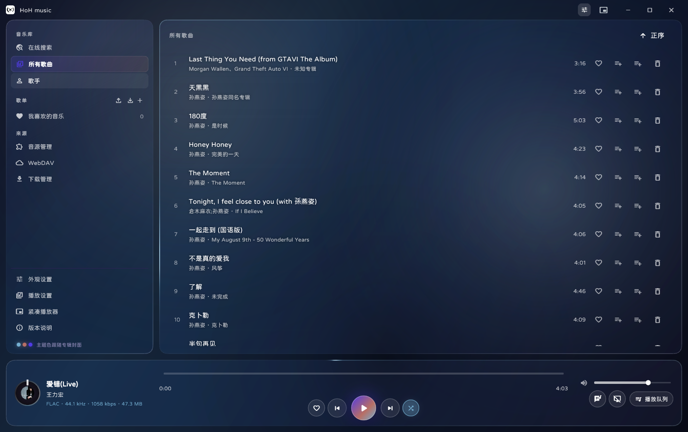
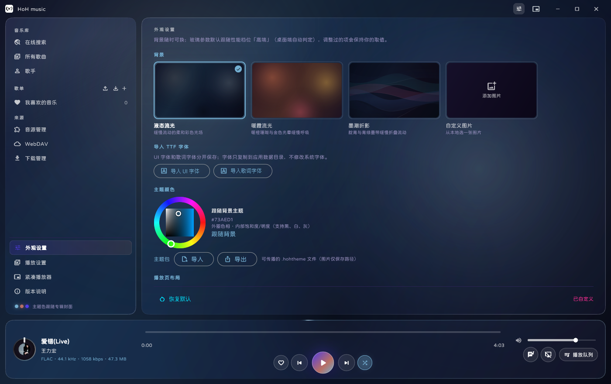
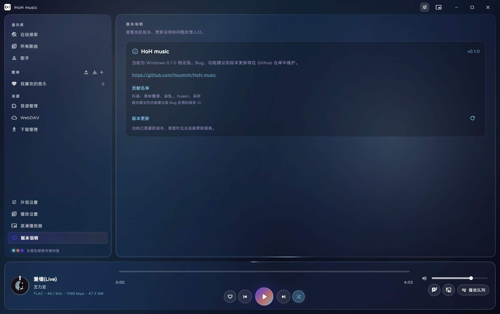
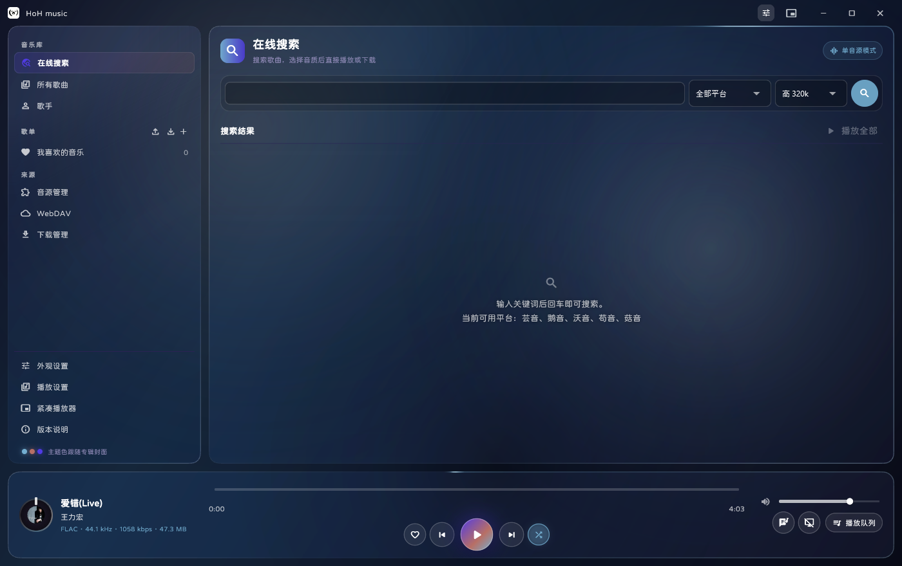
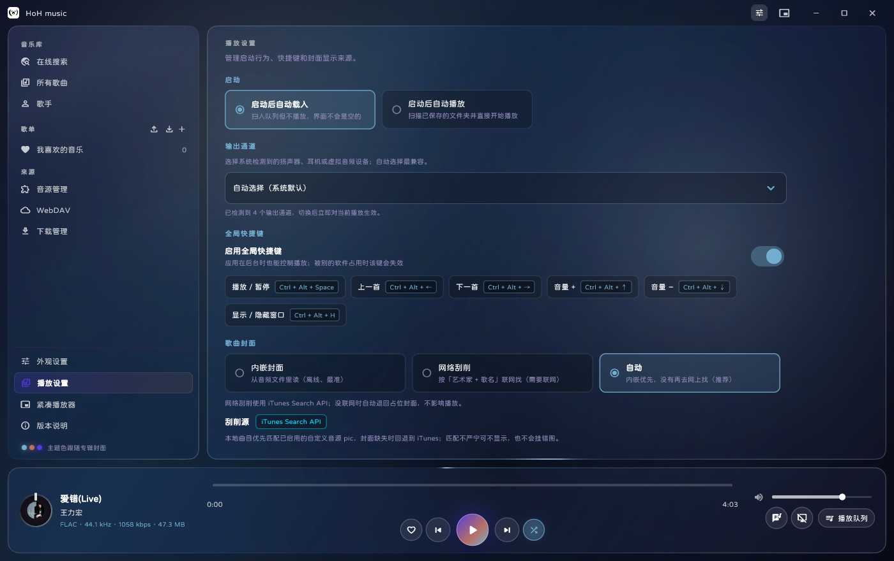

# HoH music

HoH music 是一个以 Flutter/Dart 编写的跨平台音乐播放器。Windows 首个稳定版本为 `0.1.0`；Android 移动端从 `0.0.1` 预览版开始：支持本地曲库、在线搜索播放、歌单导入导出、歌词、下载管理和动态背景。

> 当前版本：Windows `0.1.0+1`，Android `0.0.1` 预览版。Windows 安装器已发布；Android 已加入 runner 和移动端 UI，但仍需 Android SDK 与真机验收。

正式版首次启动默认使用：音量约 64.43%、列表循环、系统自动选择输出通道；外观默认采用当前确认的液态流光、底部控制区、居中歌词、关闭桌面歌词、开启动画，玻璃参数为模糊 16、填充透明度 0%、厚度约 6.64、磨砂约 0.48、折射率约 1.031、色散约 0.003、光照角约 1.426 弧度、光照强度约 0.378、环境光约 0.093、背景饱和度约 1.421、回退折射约 4.083；用户之后的调整会持久化保存。

项目仓库：[github.com/Huomnh/HoH-music](https://github.com/Huomnh/HoH-music)。欢迎通过 Issue 反馈 Bug 或提出功能建议。

本项目采用 **GNU GPL 第 3 版（GPL-3.0-only）**，完整条款见根目录 [LICENSE](LICENSE)。第三方依赖、参考项目、音源协议和媒体服务条款请查看[开源项目与协议清单](docs/开源项目与协议清单.md)。

## 界面预览

以下截图均为 `0.1.0` 当前代码重新构建后采集，旧版本预览图已清理：

| 播放页 | 所有歌曲 |
|---|---|
|  |  |

| 外观设置 | 版本说明 |
|---|---|
|  |  |

| 在线搜索 | 播放设置 |
|---|---|
|  |  |

## 主要功能

- 本地曲库：导入文件或文件夹，读取元数据，增量扫描、排序、收藏和删除列表记录；删除列表记录不会删除磁盘文件。
- 播放：MediaKit/libmpv 播放后端，队列、列表循环、进度拖动、音量、输出通道和目标优先切歌。
- 在线播放：通过可导入的 LX 格式音源脚本搜索、匹配和播放歌曲；安装包将可手动导入的脚本放在独立的 `music音源` 文件夹。
- 歌词：LRC/TTML、翻译、逐字高亮、六种 HoH 视觉模式、专辑信息歌词页和 Windows 桌面歌词。
- 歌单：支持 HoH `.hohplaylist` 备份格式，以及公开芸音/鹅音歌单链接导入；导入后按需匹配，不在导入阶段一次性刮削全部歌曲。
- 下载：后台下载、暂停/继续、删除、断点续传、标签写入，并可定位到歌曲实际保存目录。
- 外观：液态流光、暖霞流光、墨潮折影、墨白极简、白墨极简、自定义图片、专辑色渐变联动、液态玻璃参数、字体和主题包导入导出。
- Windows：无边框圆角窗口、紧凑播放器、单实例、系统托盘、全局快捷键、系统媒体控制、桌面歌词和关闭时“保留后台/退出程序”选择。
- Android：底部导航、单列首页/发现/我的/设置；首页支持快捷搜索、歌单导入和自建/导入歌单直达，当前播放卡片与迷你播放器可进入歌词播放页，右上角显示旋转黑胶；我的页面支持新建/导入歌单、大卡片歌单列表、左滑删除普通歌单和所有歌曲入口；全屏播放页提供轻量逐字歌词，喜欢按钮位于上一首左侧、播放列表位于下一首右侧，播放列表内可切换播放顺序。在线搜索和音源管理适配窄屏滚动，音乐库下方可直接添加/同步 WebDAV；播放时使用轻量媒体前台服务维持后台进程；Android 玻璃面板使用稳定低开销样式，避免折射错层；复用共享播放、音源、曲库、歌单和主题逻辑。普通随机队列在播放完成后由控制器手动推进，待解析歌单由统一步进器推进，避免重复切歌。
- 更新：版本说明页提供 GitHub 外部链接和手动检查；发现新 Release 时显示非强制更新提示，不会阻断当前版本使用。

默认音源脚本来自程序目录的 `music音源` 文件夹。程序启动时扫描并登记其中可用脚本，用户可以在音源管理页手动启用、替换或导入其他脚本。用户音乐库和歌曲文件不会被打包进安装器。

## 贡献名单

以下为提出建设性功能建议或 Bug 反馈的网友 ID：

**抖音：美味蟹堡、染乱.、huaan、采样**

## 开源项目致谢

感谢以下项目及维护者提供的工具、协议、数据、渲染算法和设计启发：

- [Flutter](https://github.com/flutter/flutter)、[Riverpod](https://github.com/rrousselGit/riverpod)、[MediaKit](https://github.com/media-kit/media-kit)：应用 UI、状态管理和音频播放基础。
- [LX Music Desktop](https://github.com/lyswhut/lx-music-desktop)：自定义音源协议和接入逻辑参考。
- [AMLL TTML DB](https://github.com/amll-dev/amll-ttml-db)、[AMLL TTML Tool](https://github.com/amll-dev/amll-ttml-tool)：歌词数据和 TTML 时间轴研究参考。
- [Pure Music](https://github.com/qingyueyin/Pure-music)、[ZeroBit Player](https://github.com/Empty-57/ZeroBit-Player)：歌词视觉动画和逐字高亮实现参考；HoH 的播放后端仍为自有实现。
- [Any Listen](https://github.com/any-listen/any-listen)、[Namida](https://github.com/namidaco/namida)、[Particle Music](https://github.com/AfalpHy/ParticleMusic)、[Coriander Player](https://github.com/Ferry-200/coriander_player)：播放器交互、曲库和跨平台结构参考。

HoH music 不隶属于上述项目。具体改编范围和许可证入口见[开源项目与协议清单](docs/开源项目与协议清单.md)。

## 正式版验证状态

- `flutter analyze --no-pub`：通过。
- `flutter test --reporter compact`：91 项通过；测试环境会输出 MediaKit 原生依赖不可用提示，但测试本身通过。
- `flutter build windows --release`：正式版构建通过。
- Windows 安装器：Release bundle、许可证、第三方清单、`music音源` 文件夹、可选安装目录和默认桌面快捷方式均纳入打包检查。
- 当前安装器：`dist/windows/HoH-music-Setup-0.1.0-Windows-x64.exe`，47.14 MiB，SHA-256：`81846EB8507F63AAF613D27CCD33C17AE0720F4D1CDF9FD1A7B68D2B43C9666C`。
- 安装器已完成自选目录安装/卸载冒烟测试；未签名，干净 Windows 用户环境的长时间播放验收仍属于发布后的边界。
- 已执行自定义目录安装/卸载冒烟检查；干净电脑首次启动、实际音频设备、在线音源服务和代码签名仍需发布者在目标环境复核。
- 安装器当前未签名。正式对外分发建议使用可信代码签名证书，减少 Windows SmartScreen 警告。

## 开发环境与构建

- Flutter 3.47.5 stable / Dart 3.13.4
- Windows 构建需要 Visual Studio C++ Desktop workload；`smtc_windows` 还需要 Rust/Cargo 工具链。
- 依赖由 `pubspec.lock` 锁定，请勿删除锁文件。

```powershell
cd E:\HoH-music
flutter pub get
flutter analyze --no-pub
flutter test --reporter compact
flutter build windows --release
powershell -ExecutionPolicy Bypass -File scripts\package-windows.ps1
```

安装器输出到 `dist\windows\`，文件名为 `HoH-music-Setup-0.1.0-Windows-x64.exe`。使用以下命令获取校验值：

```powershell
Get-FileHash .\dist\windows\HoH-music-Setup-0.1.0-Windows-x64.exe -Algorithm SHA256
```

安装器允许修改安装位置并默认创建桌面快捷方式；安装包不包含用户音乐库。`music音源` 作为可手动导入的独立文件夹随安装器分发。

## 发布到 GitHub Releases

1. 打开仓库的 [Releases](https://github.com/Huomnh/HoH-music/releases)，选择 **Draft a new release**。
2. 标签填写 `v0.1.0`，目标分支选择 `main`。
3. 上传 `dist/windows/HoH-music-Setup-0.1.0-Windows-x64.exe`，并在说明中附上 SHA-256 校验值和已知限制。
4. 确认 `Set as the latest release` 后发布。应用的非强制更新检查会识别包含 `Windows-x64` 且优先包含 `Setup` 的 `.exe` 安装包。

源码仓库不提交 `dist/` 安装器；更新机制和命名规则见[更新机制](docs/更新机制.md)。

## 文档入口

- [项目架构](音乐播放器架构文档.md)
- [项目进度交接](docs/项目进度交接.md)
- [变更记录](docs/变更记录.md)
- [Windows 构建指南](docs/Windows预览指南.md)
- [Android 预览与构建指南](docs/Android预览指南.md)
- [多平台构建可行性](docs/多平台构建可行性.md)
- [歌词视觉器规划](docs/歌词原生FlutterVisualizer规划.md)
- [开源项目与协议清单](docs/开源项目与协议清单.md)
- [文档维护规范](docs/文档维护规范.md)

## 当前边界

当前正式发布目标为 Windows x64；Android `0.0.1` 已可构建 Debug APK，已接入基础前台播放保活，但媒体通知、音频焦点、权限和真机长时间播放尚未完成发布验收。APK 默认输出到 `build/app/outputs/flutter-apk/app-debug.apk`。iOS、macOS、Linux、TV、跨端同步和 Home Assistant 尚未完成独立平台工程与发布验收。
